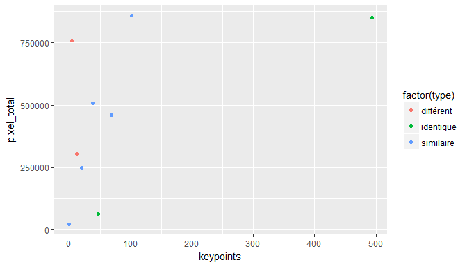

Keypoints matching and image definition
================

Scatter plot
------------

 .

Comme on peut le voir, les étiquettes représentant les mêmes vins ont généralement un grand nombre de keypoints en commun. Cependant, les étiquettes représentant des vins différents provenant d'un même producteur ont elles aussi beaucoup de keypoints en commun. Plus la qualité des étiquettes est élevée plus de keypoints sont détectés. Et de ce fait, il y a éventuellement plus de match possible.
